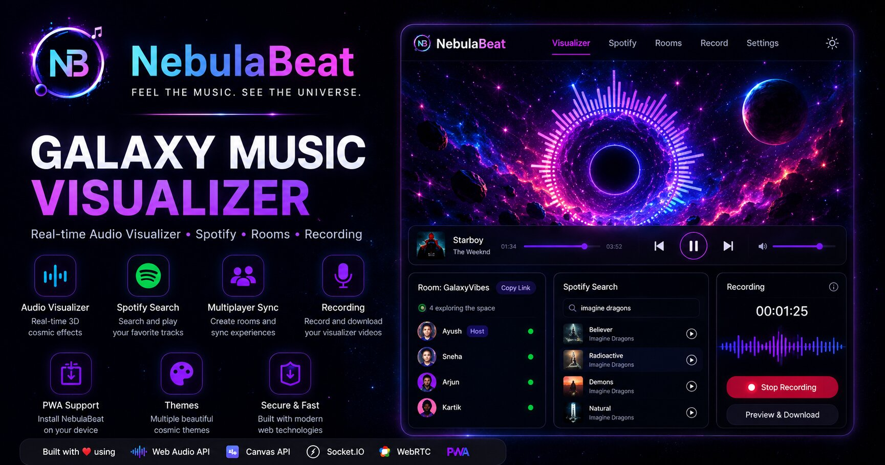
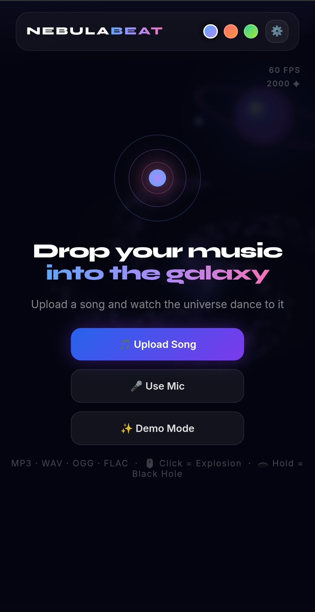
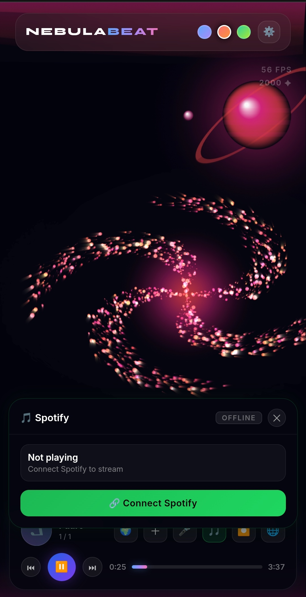
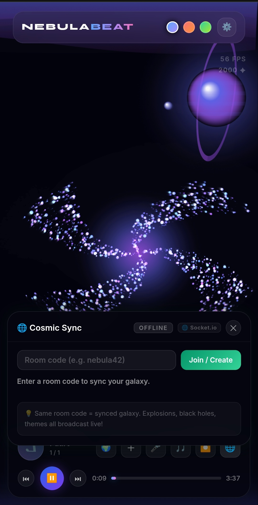

# 🌌 NebulaBeat



Feel the Music. See the Universe.

NebulaBeat is a futuristic galaxy-themed music visualizer built with modern web technologies. Upload your music, visualize audio in real-time, search Spotify tracks, create multiplayer rooms, record visualizer sessions, and install the app as a Progressive Web App.

🔗 **Live Demo:** [NebulaBeat](https://ayushrajfrontend.github.io/NebulaBeat/)

---

## ✨ Features

🎵 Audio Visualizer

- Real-time audio visualization
- Galaxy and cosmic effects
- Dynamic particles and animations
- Multiple visualizer modes

🎧 Spotify Integration

- Spotify OAuth Login
- Spotify Track Search
- Web Playback SDK Support
- Track Information Display

👥 Multiplayer Rooms

- Create and join rooms
- Real-time synchronization
- Shared visualizer experience
- Room-based interactions

🎙 Recording System

- Record visualizer sessions
- Download recordings
- Capture audio-reactive effects

📱 Progressive Web App (PWA)

- Install on mobile and desktop
- App-like experience
- Offline support
- Custom icon and splash screen

🎨 Custom Themes

- Multiple galaxy-inspired themes
- Dynamic color palettes
- Personalized experience

---

## 🚀 Tech Stack

### Frontend
- HTML5
- CSS3
- JavaScript (ES6+)
- Web Audio API
- Canvas API

### Backend
- Node.js
- Express.js
- Socket.IO

### APIs & Services
- Spotify Web API
- Spotify Web Playback SDK
- WebRTC
- Railway

---

## 📸 Screenshots

Main Interface



Spotify Integration



Multiplayer Rooms



---

## 📦 Installation

### Run Locally

```bash
git clone https://github.com/AyushRajFrontend/NebulaBeat.git
cd NebulaBeat
```

Open `index.html` in your browser or use Live Server.

---

## 🌐 Deployment

Frontend

GitHub Pages

Backend

Railway

---

## 🔥 Core Technologies Used

- Web Audio API
- Canvas Rendering
- Socket.IO
- WebRTC
- Spotify API
- PWA
- Service Workers

---

## 🎯 Future Plans

- Real-time Shared Listening Rooms
- Playlist Synchronization
- Voice Chat
- Advanced Visualizer Effects
- AI Powered Themes
- User Profiles

---

## 👨‍💻 Developer

Ayush Raj

GitHub: https://github.com/AyushRajFrontend

---

## ⭐ Support

If you like NebulaBeat, consider giving the repository a star ⭐

---

### 🌌 NebulaBeat
### Feel the Music. See the Universe.
